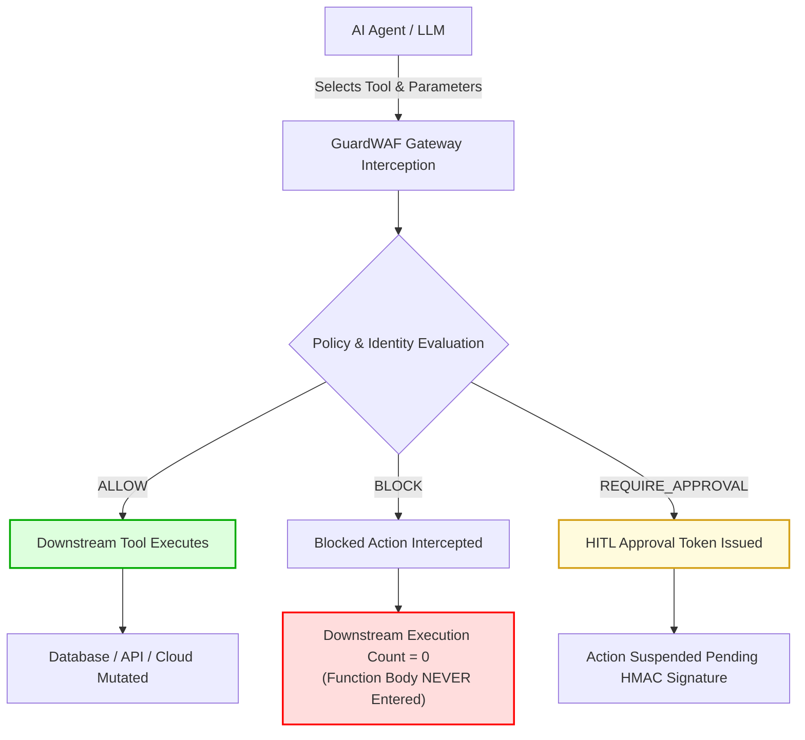

# GuardWAF — Enterprise Agent WAF & Action Guardrail Gateway

[](https://github.com/Aadhidharmar001/GaurdWAF_Version-2/actions/workflows/ci_cd.yml)
[](LICENSE)
[](pyproject.toml)
[](SECURITY.md)
[](#-public-developer-beta-status)

> **GuardWAF is an Enterprise Agent Web Application Firewall (WAF) and Action Guardrail Gateway.**
> It intercepts and authorizes AI agent tool calls *before* backend actions execute—enforcing fine-grained action policies, parameter integrity, human-in-the-loop approvals, and emergency revocation with **zero network latency** on the local enforcement hot path.

---

> [!IMPORTANT]
> ### 📢 Public Developer Beta Status
> GuardWAF is in **public developer beta**. Engineering validation is complete (142/142 tests passing, automated SBOM generation, secret scanning, and multi-stage CI/CD verified).
>
> Independent external developer validation is actively being collected. External metrics remain **UNKNOWN / AWAITING REAL EXTERNAL EVIDENCE** until independent developers evaluate the system in real environments.
> See our [Public Beta Program Guide](docs/PUBLIC_BETA.md) to test and share feedback.

---

## 🎯 The Problem: Why Output Guardrails Are Not Enough

Autonomous AI agents equipped with tools (e.g. database access, payment gateways, cloud APIs, shell access) can produce completely polite, helpful conversational output while simultaneously generating destructive or unauthorized backend actions.

Traditional LLM guardrails inspect **natural language output**. GuardWAF governs **ACTION AUTHORIZATION**.

| Evaluation Dimension | Traditional LLM Output Guardrails | GuardWAF Action Guardrail Gateway |
| :--- | :--- | :--- |
| **Inspection Target** | Generated prompt text / strings | Executable tool calls & parameter payloads |
| **Enforcement Point** | After LLM text generation | **Before downstream tool code executes** |
| **Threat Model** | Toxic output, bias, prompt leakage | Unauthorized fund transfer, SQL mutation, shell injection, privilege escalation |
| **Decision Authority** | Statistical classifier / LLM evaluator | Deterministic policy engine & HMAC cryptographic tokens |
| **Hot-Path Overhead** | 200 ms – 1500 ms (secondary LLM call) | **< 0.2 ms local deterministic hot path** |
| **Downstream Guarantee** | None (tool may have already run) | **Guaranteed zero downstream execution on blocked actions** |

---

## 🛡️ Core Security Guarantee: Zero Downstream Execution

When GuardWAF denies an action or halts it for human approval:
- **Downstream execution count is strictly 0.**
- The target function or tool body is **never entered**.
- Network connections, database mutations, and external API requests are never initiated.
- The rejection event is cryptographically audited in tamper-evident hash chains.



---

## ⚡ Core Capabilities (Verified & Implemented)

All features below are implemented, tested across 33 test modules, and verified in this repository:

- **Pre-Execution Action Authorization**: Intercepts tool calls before function bodies or external API calls execute.
- **Declarative Policy Evaluation**: Define rules via YAML or typed Pydantic models (`PolicyConfig`, `PolicyRules`).
- **Granular Parameter Validation**: Value range limits, regex pattern enforcement, allowed lists, and parameter type constraints.
- **Bulk & Rate Thresholds**: Cap financial amounts, record mutation counts, and velocity per session.
- **Sequence & Data Scope Controls**: Enforce required prerequisite tool sequences and prevent data boundary violations.
- **Human-in-the-Loop (HITL) Suspension**: Suspend high-risk actions into cryptographically signed pending action tokens.
- **Exactly-Once Token Execution**: Nonce-backed single-use tokens prevent action replay attacks.
- **Parameter Digest Integrity**: SHA-256 parameter hashing binds approved tokens directly to exact argument values.
- **Cryptographic HMAC Signature Verification**: Secret-keyed signatures ensure approvals cannot be forged by untrusted actors.
- **Local $O(1)$ Agent Revocation / Kill Switch**: Revoke compromised agents instantly in sub-millisecond memory lookups.
- **Zero-Network Local Hot Path**: Evaluates policies in-process ($p50 < 0.2\text{ ms}$, $> 6,000\text{ req/sec}$), independent of external control plane availability.
- **Last-Known-Good (LKG) Resiliency**: Cached policies allow seamless local enforcement even if central services are unreachable.
- **Fail-Closed Architecture**: Any policy ambiguity, evaluation error, or missing dependency defaults to action denial.
- **Tenant & Identity Isolation**: Partition policies, audit trails, and token validation by tenant and agent ID.

---

## 🔌 Supported Framework Integrations

GuardWAF provides official, verified integration adapters for all major agent frameworks:

| Framework | Verified Adapter | Integration Pattern |
| :--- | :--- | :--- |
| **Python Standard Functions** | `@guardwaf.protect` decorator | Wrap arbitrary callables or SDK functions |
| **LangChain** | `LangChainAdapter` / `guardwaf_tool` | Intercepts `BaseTool` and dynamic tools |
| **LangGraph** | `LangGraphAdapter` | State graph tool nodes & pre-execution gates |
| **CrewAI** | `CrewAIAdapter` | Agent tool bindings & delegated authority |
| **Model Context Protocol (MCP)** | `MCPGatewayProxy` | Standard MCP & FastMCP server request interception |
| **Custom Agent Loops** | `AgentRuntimeAdapter` / `GuardWAF` SDK | Explicit session-based action authorization |

---

## 📦 Installation

GuardWAF is currently in **public developer beta**. You can install it directly from GitHub or build a local release wheel:

### Option A: Install from GitHub (Recommended for Beta Testing)
```bash
pip install "git+https://github.com/Aadhidharmar001/GaurdWAF_Version-2.git"
```

### Option B: Install from Local Release Wheel
```bash
# Clone the repository
git clone https://github.com/Aadhidharmar001/GaurdWAF_Version-2.git
cd GaurdWAF_Version-2

# Build wheel package
python scripts/build_release.py

# Install wheel
pip install dist/*.whl
```

### Option C: Editable Development Install
```bash
git clone https://github.com/Aadhidharmar001/GaurdWAF_Version-2.git
cd GaurdWAF_Version-2
pip install -e ".[all]"
```

*(PyPI publication will occur upon completion of external beta developer validation.)*

---

## ⚡ 60-Second Quickstart

Create a file `quickstart.py` and run it:

```python
from guardwaf import GuardWAF, protect, GuardWAFSecurityError
from guardwaf.core.models import PolicyConfig, PolicyRules, BulkThresholdRule

# 1. Define Declarative Security Policy
rules = PolicyRules(bulk_thresholds=[BulkThresholdRule(tool="issue_refund", param_name="amount", max_value=100.0)])
policy = PolicyConfig(metadata={"policy_name": "refund_guard"}, rules=rules)

# 2. Initialize GuardWAF Engine
waf = GuardWAF(policy=policy, secret_key="demo_secret_key_minimum_32_bytes_long")

# Track downstream executions to verify the security invariant
execution_counter = {"executed_count": 0}


# 3. Protect Your Sensitive Tool
@protect(tool_name="issue_refund", client=waf)
def issue_refund(customer_id: str, amount: float):
    execution_counter["executed_count"] += 1
    return {"status": "SUCCESS", "customer": customer_id, "amount": amount}


# 4. Execute Actions inside a Session
with waf.session(session_id="session_beta_01"):
    # Scenario A: Allowed Action ($50 <= $100 max)
    result = issue_refund(customer_id="cust_001", amount=50.0)
    print(f"✅ ALLOWED ACTION: Refund of ${result['amount']} executed.")
    print(f"   Downstream Execution Count: {execution_counter['executed_count']}")

    # Scenario B: Blocked Dangerous Action ($5,000 > $100 max)
    try:
        issue_refund(customer_id="cust_001", amount=5000.0)
    except GuardWAFSecurityError as err:
        print(f"🚨 BLOCKED DANGEROUS ACTION: {err}")
        print(f"   Downstream Execution Count: {execution_counter['executed_count']} (UNCHANGED)")

# Verify the core guarantee
assert execution_counter["executed_count"] == 1, "Blocked action must never execute downstream!"
print("🛡️ GUARANTEE CONFIRMED: Blocked action had ZERO downstream execution.")
```

**Run it:**
```bash
python quickstart.py
```

**Expected Output:**
```text
✅ ALLOWED ACTION: Refund of $50.0 executed.
   Downstream Execution Count: 1
🚨 BLOCKED DANGEROUS ACTION: Action 'issue_refund' blocked by GuardWAF policy: Bulk Threshold Exceeded: Parameter 'amount' value 5000.0 exceeds max 100.0
   Downstream Execution Count: 1 (UNCHANGED)
🛡️ GUARANTEE CONFIRMED: Blocked action had ZERO downstream execution.
```

---

## 🎮 Interactive Playground

Experience real-time interception, human-in-the-loop approval gates, prompt injection defense, and agent revocation interactively:

```bash
python examples/playground/main.py
```

---

## ⚡ Performance Benchmark Baseline

GuardWAF is engineered for high-throughput, latency-critical production environments:

| Benchmark Metric | Measured Result | Production SLA Target |
| :--- | :--- | :--- |
| **Local Policy Enforcement Rate** | **6,478 req/sec** | $> 1,000\text{ req/sec}$ |
| **Hot-Path p50 Latency** | **0.1304 ms** | $< 1.0\text{ ms}$ |
| **Hot-Path p95 Latency** | **0.2664 ms** | $< 2.0\text{ ms}$ |
| **Hot-Path p99 Latency** | **0.4535 ms** | $< 5.0\text{ ms}$ |
| **100 Concurrent Agent Sessions** | **6,132 req/sec** | $> 1,000\text{ req/sec}$ |

---

## 📚 Documentation Portal Map

- [Getting Started & Installation Guide](docs/getting_started/installation.md)
- [60-Second Quickstart Guide](docs/getting_started/quickstart.md)
- [Framework Compatibility & Adapters](docs/getting_started/compatibility.md)
- [Policy Configuration & Rule Types](docs/concepts/policies.md)
- [ActionEnvelope Transport Specification](docs/concepts/action_envelope.md)
- [Human-in-the-Loop (HITL) Governance](docs/concepts/hitl.md)
- [Agent Revocation & Emergency Kill Switch](docs/concepts/revocation.md)
- [Security Model & Threat Boundaries](docs/security/security_model.md)
- [AWS Production Deployment Blueprint](docs/production_deployment.md)
- [Public Beta Program & Feedback](docs/PUBLIC_BETA.md)
- [Beta Release Checklist](docs/public_beta_release_checklist.md)

---

## ⚖️ License & Community

GuardWAF is open source software licensed under the [MIT License](LICENSE).

- **Security & Responsible Disclosure**: [SECURITY.md](SECURITY.md)
- **Contributing Guidelines**: [CONTRIBUTING.md](CONTRIBUTING.md)
- **Code of Conduct**: [CODE_OF_CONDUCT.md](CODE_OF_CONDUCT.md)
- **Changelog**: [CHANGELOG.md](CHANGELOG.md)