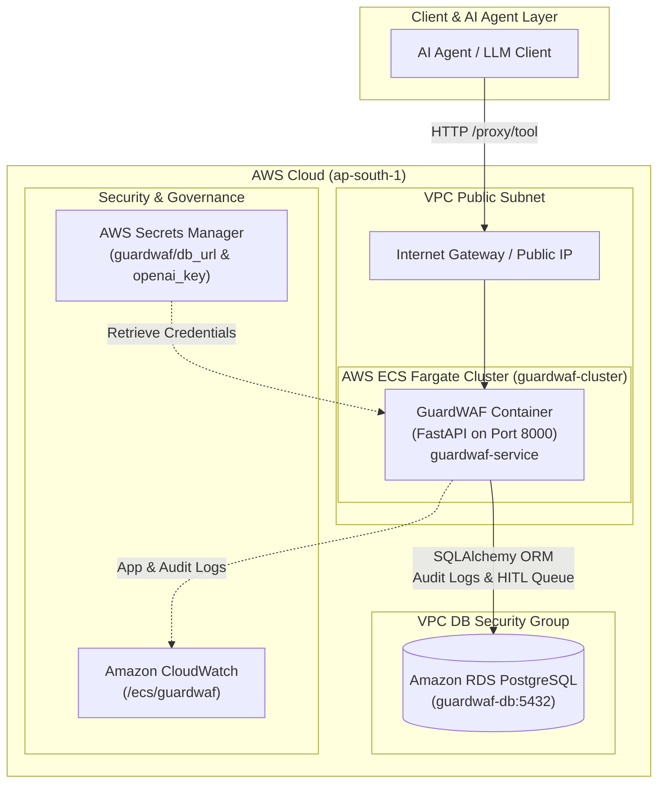

# GuardWAF AWS ECS Fargate + Amazon RDS Deployment Runbook

This guide documents the automated production deployment of **GuardWAF (PS-5.1 Agent WAF & Guardrail Gateway)** on **AWS ECS Fargate** with **Amazon RDS PostgreSQL** in region `ap-south-1`.

---

## 🏗️ Architecture



---

## 📋 Deployment Summary Table

| Infrastructure Component | AWS Service | Configuration Details |
| :--- | :--- | :--- |
| **Container Engine** | Amazon ECS Fargate | Serverless execution (`guardwaf-task`, 0.5 vCPU, 1 GB RAM) |
| **Container Registry** | Amazon ECR | Repository: `161012475437.dkr.ecr.ap-south-1.amazonaws.com/guardwaf:latest` |
| **Database** | Amazon RDS PostgreSQL | Engine: PostgreSQL 15, DB Name: `guardwaf`, Port: `5432` |
| **Log Management** | Amazon CloudWatch | Log Group: `/ecs/guardwaf` |
| **Secrets & Keys** | AWS Secrets Manager | Secrets: `guardwaf/db_url` and `guardwaf/openai_key` |
| **Networking & Access** | AWS VPC & Security Groups | Inbound port 8000 for FastAPI, port 5432 restricted to ECS SG |

---

## 🚀 Step-by-Step Deployment Guide

### 1. Build and Push Container Image to Amazon ECR
```bash
AWS_REGION="ap-south-1"
ACCOUNT_ID="161012475437"
ECR_URI="${ACCOUNT_ID}.dkr.ecr.${AWS_REGION}.amazonaws.com/guardwaf:latest"

# Authenticate Docker to ECR
aws ecr get-login-password --region $AWS_REGION | docker login --username AWS --password-stdin ${ACCOUNT_ID}.dkr.ecr.${AWS_REGION}.amazonaws.com

# Create ECR repo if it does not exist
aws ecr create-repository --repository-name guardwaf --region $AWS_REGION || true

# Build and Push
docker build -t guardwaf:latest .
docker tag guardwaf:latest $ECR_URI
docker push $ECR_URI
```

---

### 2. Create Amazon RDS PostgreSQL Instance
```bash
# Create Security Group for RDS
VPC_ID=$(aws ec2 describe-vpcs --filters Name=isDefault,Values=true --query "Vpcs[0].VpcId" --output text --region $AWS_REGION)

RDS_SG_ID=$(aws ec2 create-security-group \
    --group-name guardwaf-rds-sg \
    --description "GuardWAF RDS Security Group" \
    --vpc-id $VPC_ID \
    --query GroupId --output text --region $AWS_REGION || aws ec2 describe-security-groups --filters Name=group-name,Values=guardwaf-rds-sg --query "SecurityGroups[0].GroupId" --output text --region $AWS_REGION)

# Provision RDS PostgreSQL Instance
aws rds create-db-instance \
    --db-instance-identifier guardwaf-db \
    --db-name guardwaf \
    --engine postgres \
    --engine-version 15.4 \
    --allocated-storage 20 \
    --db-instance-class db.t4g.micro \
    --master-username guardwaf \
    --master-user-password "GuardWAFSecurePassword2026!" \
    --vpc-security-group-ids $RDS_SG_ID \
    --publicly-accessible \
    --region $AWS_REGION

# Wait for RDS instance to become available
aws rds wait db-instance-available --db-instance-identifier guardwaf-db --region $AWS_REGION

# Retrieve RDS Endpoint Address
RDS_ENDPOINT=$(aws rds describe-db-instances --db-instance-identifier guardwaf-db --region $AWS_REGION --query "DBInstances[0].Endpoint.Address" --output text)
echo "RDS Endpoint: ${RDS_ENDPOINT}"
```

---

### 3. Store Secrets in AWS Secrets Manager
```bash
DATABASE_URL="postgresql://guardwaf:GuardWAFSecurePassword2026!@${RDS_ENDPOINT}:5432/guardwaf"

# Store Database URL secret
aws secretsmanager create-secret \
    --name guardwaf/db_url \
    --secret-string "$DATABASE_URL" \
    --region $AWS_REGION || aws secretsmanager put-secret-value --secret-id guardwaf/db_url --secret-string "$DATABASE_URL" --region $AWS_REGION

# Store OpenAI API Key secret
aws secretsmanager create-secret \
    --name guardwaf/openai_key \
    --secret-string "sk-proj-demo-key" \
    --region $AWS_REGION || true
```

---

### 4. Create CloudWatch Log Group & IAM Role
```bash
# CloudWatch Log Group
aws logs create-log-group --log-group-name /ecs/guardwaf --region $AWS_REGION || true

# Execution Role
aws iam create-role --role-name ecsTaskExecutionRole --assume-role-policy-document '{"Version":"2012-10-17","Statement":[{"Effect":"Allow","Principal":{"Service":"ecs-tasks.amazonaws.com"},"Action":"sts:AssumeRole"}]}' || true
aws iam attach-role-policy --role-name ecsTaskExecutionRole --policy-arn arn:aws:iam::aws:policy/service-role/AmazonECSTaskExecutionRolePolicy || true

# Grant permission to read secrets from Secrets Manager
aws iam put-role-policy --role-name ecsTaskExecutionRole --policy-name GuardWAFSecretsAccess --policy-document "{\"Version\":\"2012-10-17\",\"Statement\":[{\"Effect\":\"Allow\",\"Action\":[\"secretsmanager:GetSecretValue\"],\"Resource\":\"arn:aws:secretsmanager:${AWS_REGION}:${ACCOUNT_ID}:secret:guardwaf/*\"}]}"
```

---

### 5. Register Task Definition & Launch ECS Fargate Service
```bash
# Register Task Definition
aws ecs register-task-definition --cli-input-json file://infra/ecs-task-def.json --region $AWS_REGION

# Create ECS Cluster
aws ecs create-cluster --cluster-name guardwaf-cluster --region $AWS_REGION || true

# Security Group for ECS Task
ECS_SG_ID=$(aws ec2 create-security-group \
    --group-name guardwaf-ecs-sg \
    --description "GuardWAF ECS Task Security Group" \
    --vpc-id $VPC_ID \
    --query GroupId --output text --region $AWS_REGION || aws ec2 describe-security-groups --filters Name=group-name,Values=guardwaf-ecs-sg --query "SecurityGroups[0].GroupId" --output text --region $AWS_REGION)

# Allow HTTP ingress on port 8000
aws ec2 authorize-security-group-ingress --group-id $ECS_SG_ID --protocol tcp --port 8000 --cidr 0.0.0.0/0 --region $AWS_REGION || true

# Allow ECS SG to connect to RDS SG on port 5432
aws ec2 authorize-security-group-ingress --group-id $RDS_SG_ID --protocol tcp --port 5432 --source-group $ECS_SG_ID --region $AWS_REGION || true

# Launch Fargate Service
SUBNET_ID=$(aws ec2 describe-subnets --filters Name=vpc-id,Values=$VPC_ID --query "Subnets[0].SubnetId" --output text --region $AWS_REGION)

aws ecs create-service \
    --cluster guardwaf-cluster \
    --service-name guardwaf-service \
    --task-definition guardwaf-task \
    --desired-count 1 \
    --launch-type FARGATE \
    --network-configuration "awsvpcConfiguration={subnets=[$SUBNET_ID],securityGroups=[$ECS_SG_ID],assignPublicIp=ENABLED}" \
    --region $AWS_REGION || true
```

---

### 6. Verification Commands

#### Fetch Running Fargate Task Public IP
```bash
TASK_ARN=$(aws ecs list-tasks --cluster guardwaf-cluster --service-name guardwaf-service --region ap-south-1 --query "taskArns[0]" --output text)
ENI_ID=$(aws ecs describe-tasks --cluster guardwaf-cluster --tasks $TASK_ARN --region ap-south-1 --query "tasks[0].attachments[0].details[?name=='networkInterfaceId'].value" --output text)
PUBLIC_IP=$(aws ec2 describe-network-interfaces --network-interface-ids $ENI_ID --region ap-south-1 --query "NetworkInterfaces[0].Association.PublicIp" --output text)

echo "Live Fargate Public IP: ${PUBLIC_IP}"
```

#### Test Endpoints
- **Health Check**: `curl http://${PUBLIC_IP}:8000/health`
- **Dashboard UI**: Open `http://${PUBLIC_IP}:8000/static/index.html` in browser
- **Audit Logs**: `curl http://${PUBLIC_IP}:8000/logs`

#### Check CloudWatch Logs
```bash
aws logs tail /ecs/guardwaf --follow --region ap-south-1
```

---

## ⏸️ Billing & Scaling Controls

To pause Fargate compute charges when not testing:
```bash
# Stop Billing (Scale to 0 Tasks)
aws ecs update-service --cluster guardwaf-cluster --service guardwaf-service --desired-count 0 --region ap-south-1

# Resume Deployment (Scale to 1 Task)
aws ecs update-service --cluster guardwaf-cluster --service guardwaf-service --desired-count 1 --region ap-south-1
```
